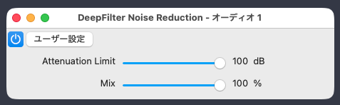

<table>
  <thead>
    <tr>
      <th style="text-align:center"><a href="README_ja.md">日本語</a></th>
      <th style="text-align:center"><a href="README.md">English</a></th>
    </tr>
  </thead>
</table>

# DeepFilterNet3 VST3

DeepFilterNet3 VST3 is a macOS audio plugin that embeds the official DeepFilterNet v0.5.6 model for real-time and offline noise reduction. It exports VST3 and CLAP bundles through nice-plug, accepts mono or stereo tracks, and keeps neural inference and sample-rate conversion on a persistent worker so the host audio callback remains nonblocking.

## Preview



## Audio demo

The plug-in bypassed and enabled:

- [Effect off — original signal (WAV)](githubreadme/effect-off.wav)
- [Effect on — DeepFilter Noise Reduction enabled (WAV)](githubreadme/effect-on.wav)

## Contents

- [Features](#features)
- [Preview](#preview)
- [Audio demo](#audio-demo)
- [Tech stack](#tech-stack)
- [Current validation scope](#current-validation-scope)
- [Audio behavior](#audio-behavior)
- [Latency](#latency)
- [Requirements](#requirements)
- [Build and model selection](#build-and-model-selection)
- [Install](#install)
- [Usage](#usage)
- [Parameters](#parameters)
- [Development and testing](#development-and-testing)
- [Project structure](#project-structure)
- [Troubleshooting](#troubleshooting)
- [Known limitations](#known-limitations)
- [License](#license)
- [Credits](#credits)

## Features

- Official DeepFilterNet3 low-latency model by default, with the official standard model available as a separate build-time option.
- Mono and stereo input/output layouts with one mono inference stream.
- Arbitrary host block sizes through fixed, timestamped worker chunks.
- Streaming conversion for 44.1, 48, 88.2, 96, 176.4, and 192 kHz host rates.
- Reported latency with sample-aligned dry/wet mixing.
- The same DSP, resamplers, timeline, and reset protocol in Realtime, Buffered, and Offline modes.
- Lock-free callback transport and a latency-aligned dry fallback when a worker result is late.
- VST3 and CLAP exports with stable plugin and parameter IDs.

## Tech stack

| Component | Role |
| :--- | :--- |
| Rust 2021 workspace | Plugin, DSP bridge, tests, and bundle task |
| [nice-plug 0.2.3](https://codeberg.org/RustAudio/nice-plug) | VST3/CLAP framework and exports |
| [DeepFilterNet 0.5.6](https://github.com/Rikorose/DeepFilterNet/tree/v0.5.6) | Official embedded model and Tract inference |
| [rubato 0.14.1](https://github.com/HEnquist/rubato/tree/v0.14.1) | Persistent fixed-size sample-rate conversion |
| [rtrb 0.3.3](https://github.com/mgeier/rtrb/tree/v0.3.3) | Lock-free worker queues |

## Current validation scope

The current implementation is built and tested on Apple Silicon with macOS 26. Automated validation includes 24 Rust tests and pluginval strictness 5 with callback allocation assertions. pluginval exercised 44.1, 48, and 96 kHz processing and automation and completed with `SUCCESS`.

DaVinci Resolve 20 is the intended host, but the final interactive playback and Deliver smoke test has not yet been completed. Windows, Linux, and Intel macOS builds have not been validated.

## Audio behavior

The embedded model always receives one channel:

- Mono input is passed directly to inference.
- Stereo input is downmixed as `(left + right) / 2` for inference.
- The mono wet result is copied to both stereo outputs.
- Each stereo channel retains its own dry signal before the aligned dry/wet mix.

The plugin delays both dry and wet output to the reported latency. During startup or a real-time worker underrun, the affected samples use dry audio from the same delayed timestamp instead of silence or a stale wet frame. Offline mode uses the same worker pipeline and may wait up to two seconds for the required timestamped result.

Unsupported sample-rate or host-buffer geometry, model startup failure, and other initialization failures select unchanged direct bypass with zero reported latency.

## Latency

Latency is calculated from live model metadata, both resamplers, and two host quanta reserved for nonblocking collection and inference. The official low-latency model reports a 48 kHz FFT size of 960, hop size of 480, zero lookahead, and 480 samples of intrinsic model delay.

| Host rate | Host quantum | Reported latency | Impulse validation |
| ---: | ---: | ---: | :--- |
| 44.1 kHz | 441 samples | 1,764 samples (40 ms) | Within 1 sample |
| 48 kHz | 480 samples | 1,440 samples (30 ms) | Exact |
| 96 kHz | 960 samples | 3,840 samples (40 ms) | Within 1 sample |

Mix values of 0%, 50%, and 100% remain peak-aligned at the reported latency. The other declared rates use the same checked formula and streaming converter geometry.

## Requirements

- Apple Silicon Mac running macOS 26.x or later for the validated configuration.
- Rust 1.87 or later to build nice-plug 0.2.3.
- A VST3- or CLAP-compatible host.

The build downloads Rust dependencies and the pinned official DeepFilterNet v0.5.6 source/model archive.

## Build and model selection

Clone the repository and build the default low-latency model:

```bash
git clone https://github.com/Shuichi346/DeepFilterNet3-VST3.git
cd DeepFilterNet3-VST3
cargo xtask bundle deepfilter-vst --release
```

Generated bundles:

```text
target/bundled/deepfilter-vst.vst3
target/bundled/deepfilter-vst.clap
```

To build the official standard model instead of the default low-latency model:

```bash
cargo xtask bundle deepfilter-vst --release --no-default-features --features model-standard
```

The model features are mutually exclusive. Exactly one of `model-ll` or `model-standard` must be enabled.

## Install

For a user-only VST3 installation on macOS:

```bash
mkdir -p "$HOME/Library/Audio/Plug-Ins/VST3"
cp -R target/bundled/deepfilter-vst.vst3 "$HOME/Library/Audio/Plug-Ins/VST3/"
```

For CLAP hosts:

```bash
mkdir -p "$HOME/Library/Audio/Plug-Ins/CLAP"
cp -R target/bundled/deepfilter-vst.clap "$HOME/Library/Audio/Plug-Ins/CLAP/"
```

Restart or rescan the host after installation. Local builds are not distributed with a Developer ID signature or Apple notarization.

## Usage

1. Build and install the VST3 or CLAP bundle, then restart or rescan the host.
2. Add **DeepFilter Noise Reduction** to a mono or stereo audio track.
3. Leave **Mix** at 100% for the fully enhanced signal, or reduce it to blend in the latency-aligned dry channel.
4. Adjust **Attenuation Limit** to cap the amount of noise attenuation. A 0 dB setting selects aligned raw audio while keeping model state advancing.

The host receives the plugin's calculated latency during initialization. If the requested host configuration is unsupported, the plugin remains available but passes audio through unchanged and reports zero latency.

## Parameters

| Parameter | Range | Default | Behavior |
| :--- | ---: | ---: | :--- |
| Attenuation Limit | 0–100 dB | 100 dB | Limits the attenuation applied by DeepFilterNet. At effectively 0 dB, the model still advances while the aligned raw path is selected. |
| Mix | 0–100% | 100% | Blends latency-aligned per-channel dry audio with the mono wet result. |

## Development and testing

Build a debug bundle with nice-plug's callback allocation assertions:

```bash
cargo xtask bundle deepfilter-vst --features nice-plug/assert_process_allocs
```

Run the bounded library and plugin validation gate:

```bash
cargo test -p deepfilter-vst --lib && \
/Applications/pluginval.app/Contents/MacOS/pluginval \
  --strictness-level 5 \
  --validate-in-process \
  target/bundled/deepfilter-vst.vst3
```

The VST3 bundle used for pluginval should be the allocation-asserting debug artifact from the preceding command.

Create the Apple Silicon release package after building the release bundles:

```bash
cargo xtask bundle deepfilter-vst --release
./scripts/package-release.sh
```

The script reads the version from `plugin/Cargo.toml`. You can also pass an explicit version:

```bash
./scripts/package-release.sh 0.5.0
```

It verifies that both bundles are thin arm64 binaries with valid ad-hoc signatures, then creates:

```text
dist/DeepFilterNR-v0.5.0-macos-arm64.zip
dist/DeepFilterNR-v0.5.0-macos-arm64.zip.sha256
```

The ZIP contains the VST3 and CLAP bundles, a concise English installation and usage README, the project MIT license, third-party notices and license material, and binary SHA-256 checksums. Existing packages are never overwritten. The script does not install or publish anything. 

## Project structure

```text
plugin/src/lib.rs        Plugin metadata, lifecycle, host layouts, and exports
plugin/src/params.rs     Attenuation Limit and Mix parameters
plugin/src/bridge.rs     Callback-side buffering, alignment, and fallback
plugin/src/dsp.rs        Worker DSP core and latency calculation
plugin/src/model.rs      DeepFilterNet model wrapper and metadata
plugin/src/resampler.rs  Checked persistent sample-rate conversion
plugin/src/worker.rs     Worker lifecycle, queues, reset, and status
xtask/                   VST3/CLAP bundle command
scripts/                 Release packaging tools
```

`PLANS.md` records the implementation and validation evidence. `CHANGELOG.md`,
`NOTES.md`, and `THIRD_PARTY_NOTICES.md` provide release changes, maintainer
notes, and dependency/model attribution.

## Troubleshooting

If a host keeps discovering an older local build, clean and recreate the release bundle before reinstalling it:

```bash
cargo clean
cargo xtask bundle deepfilter-vst --release
```

Confirm that the VST3 or CLAP directory matches the installation paths above, then restart or rescan the host. A locally built bundle is not Developer ID signed or notarized, so macOS host security behavior may differ from a distributed signed plugin.

## Known limitations

- The wet path is mono by design; stereo spatial differences remain only in the dry contribution.
- Real-time scheduling delays can temporarily substitute aligned dry audio for missing enhanced output.
- Worker/model startup is bounded to ten seconds; a startup failure selects direct bypass.
- Unsupported rate or buffer configurations select direct bypass rather than resampling approximately.
- DaVinci Resolve playback and Deliver behavior still require the final manual smoke check.
- Only the Apple Silicon macOS configuration described above has been validated.

## License

DeepFilterNet3-VST3 is licensed under the [MIT License](LICENSE).
See [Third-Party Notices](THIRD_PARTY_NOTICES.md) for bundled models, libraries, and VST 3 attribution.

## Credits

- [DeepFilterNet](https://github.com/Rikorose/DeepFilterNet) by Hendrik Schröter and contributors.
- [nice-plug](https://codeberg.org/RustAudio/nice-plug) by RustAudio contributors.
- [rubato](https://github.com/HEnquist/rubato) for streaming sample-rate conversion.
